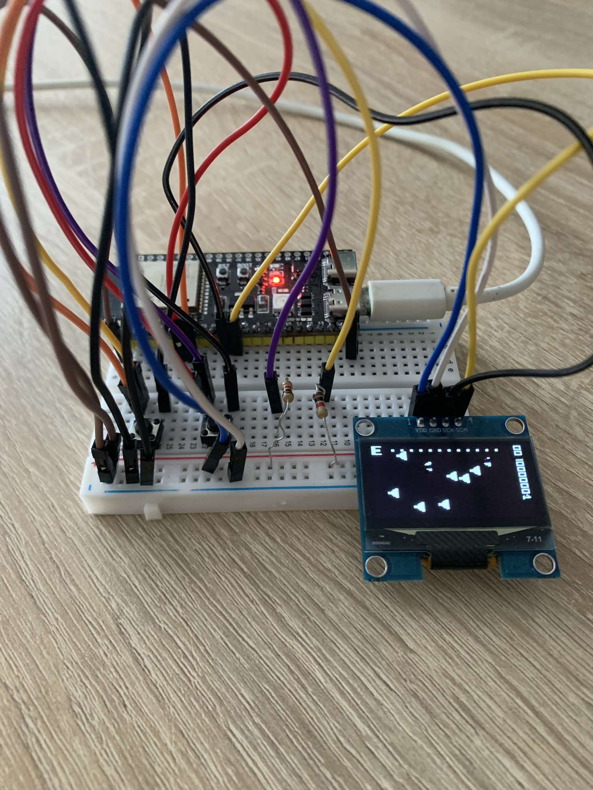

# FlyAndGunGame
It is a very simple embedded game project. It is based on the "Shoot 'em Up" type of games, and the idea is to defend against a few types of enemies that are invading your territory. The goal is to score as many points as you can while maintaining a positive health bar.
# Preview
Sample gameplay:
<br><br>
Setup:
<br><br>
# How To
## Physical Requirements
This repository is based on ESP32S3 development board with dual core 32 bit CPU up to 240 MHz and 8 MB PSRAM. To display the gameplay 1,3'' OLED display on I2C communication link is utilized and to enable player movements two buttons are needed and optionally two pull up resistors.
## Software Requirements 
To upload software on the ESP32 it is advised to setup PlatformIO environment. After that it is as simple as running below command:
```
pio run --target upload
```
# Deps:
https://github.com/nopnop2002/esp-idf-ssd1306/tree/master
